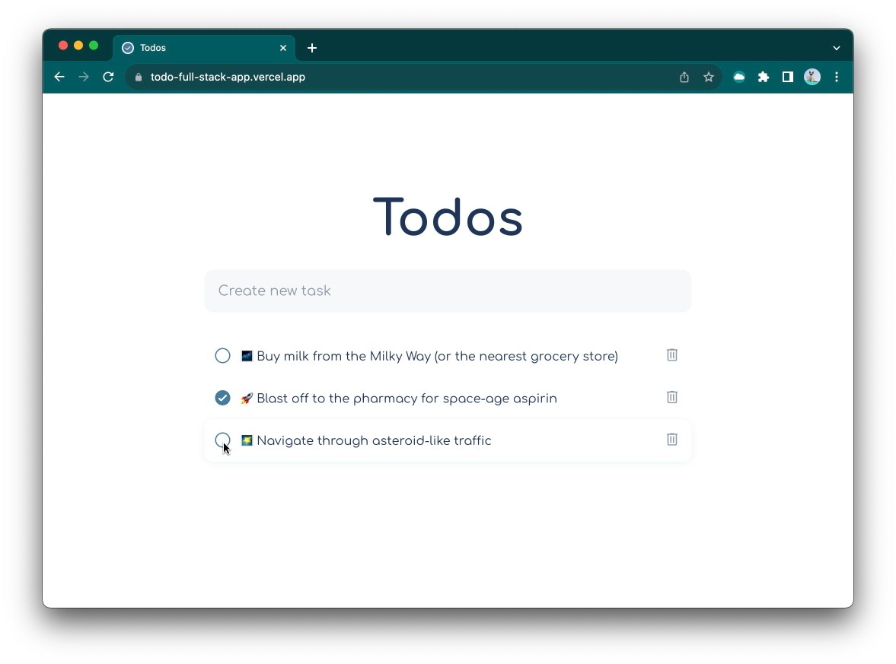

# [Todos app](https://todo-full-stack-app.vercel.app/)

I have created this app to learn how to build simple CRUD full-stack app.



I have used:

-  and  for frontend and backend
-  to model data
-  for storing users and their todo lists in the Postgres database
-  for hosting

## Developing

I used  for this project just to play around, so to
install dependencies use:

```bash
bun install
```

Start a development server:

```bash
bun --bun run dev
```

Run prisma studio:

```bash
bunx prisma generate
bunx prisma studio
```

## Building

To create a production version of your app:

```bash
bun run build
```

You can preview the production build with `bun run preview`.

## Additional resources

- [Setting up a local PostgreSQL database for prisma](https://www.prisma.io/dataguide/postgresql/setting-up-a-local-postgresql-database#setting-up-postgresql-on-macos)
- [Get started using Prisma with Bun](https://bun.sh/guides/ecosystem/prisma)
- [Everything you need to build a Svelte project, powered by `create-svelte`](https://github.com/sveltejs/kit/tree/master/packages/create-svelte).
